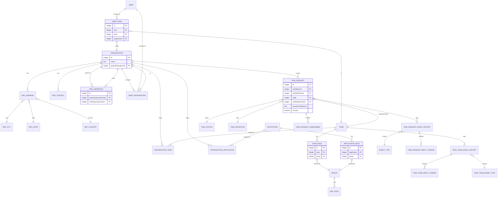

# Entity Relationship Diagram — User Access Management (UAM)

**Application:** User Access Management (UAT_1) · **Platform:** Appian
**Data source:** MariaDB `UAMS` (all entities are Appian synced records)

## 1. Data Model Overview

The UAM data model is organized around three centers of gravity. **Organization** is the top-level container: it owns its addresses, contacts, and a self-referencing parent/child hierarchy (via `Organization Hierarchy Data`), and it anchors the mappings to users, teams, and applications. The **User ↔ Team ↔ Organization** access triangle — expressed through the `User Organization`, `User Team`, and `Organization Team` junction tables — captures who belongs where. And the **Task Request** entity models the access request/approval lifecycle, with a rich audit sub-model hanging off it.

The design uses classic patterns throughout: **lookup tables** for reference data (`Ref Country/State/City`, `Ref Role`, `Task Status`, `Task Definiation`) and enumerations; **junction tables** for the many-to-many relationships between users, organizations, teams, applications, and roles; a **self-referencing hierarchy** table where `Organization Hierarchy Data` points at Organization twice (parent and child) to model the org tree; and an **append-only audit sub-model** where each `Task Request` (and its team-side counterpart) fans out to an event history, threaded replies, subscribers, and an event-type lookup.

Notable characteristics: every entity carries a surrogate integer `id` primary key, camelCase fields, and standard audit columns (`createdBy/On`, `modifiedBy/On`, `isActive` soft-delete). Security groups (`UAM Group`) are first-class data — team roles and application roles both FK to a Group, tying the data model directly to the access-control model. All 31 tables replicate from the single `UAMS` schema; there are no cross-database relationships.

## 2. Entity Relationship Diagram

## 3. Entity Summary Table

| Entity | Approx. relationships | Kind | Description |
|--------|----------------------|------|-------------|
| Organization | 10 out/in | Root | Top-level container; owns addresses, contacts, hierarchy, and all mappings |
| User | 2 | Root | A person who can be granted access |
| Team | 4 | Root | Group within an organization that access is requested for |
| Application | 2 | Root | A governed business application |
| Group | 2 (in) | Root | Appian security group backing team & application roles |
| Task Request | 6 | Core | Access request (grant/revoke) with status, type, org, team |
| Organization Address | 4 | Child | Org postal address (city/state/country FKs) |
| Organization Contact Details | 1 | Child | Org contacts |
| Organization Hierarchy Data | 2 (self-ref) | Child | Parent↔child org relationships |
| Team Role | 2 | Child | A team's role, backed by a Group |
| Application Role | 2 | Child | An application's role, backed by a Group |
| User Organization | 2 | Junction | User ↔ Organization |
| User Team | 3 | Junction | User ↔ Team ↔ Organization |
| Organization Team | 2 | Junction | Organization ↔ Team |
| Organization Application | 2 | Junction | Organization ↔ Application |
| Task Request Event History | 3 | Audit | Business events on a request |
| Task Request Reply Thread | 2 | Audit | Threaded replies on request events |
| Task Request Subscriber | 2 | Audit | Users subscribed to a request |
| Task Team Event History / Reply Thread / Subscriber | 2–3 each | Audit | Parallel audit sub-model for team events |
| Task Request/Team Event Type | 1 (in) | Lookup | Event-type enumerations |
| Task Status | 1 (in) | Lookup | In progress / Approved / Rejected / Cancelled |
| Task Definiation | 1 (in) | Lookup | Team Access Add / Revoke Approval |
| Ref Country / Ref State / Ref City | 1 (in) each | Lookup | Geographic reference data |
| Ref Role | 1 (in) | Lookup | Role reference values |
| Feedback Category | — | Lookup | Feedback categories |

*31 record types · 52 relationships. Entity boxes strip the `UAM` prefix for readability; the underlying records are `UAM <Name>` (note as-built spellings `Definiation`, `Hichearcy`). The diagram foregrounds the primary relationships; the full field-level detail per entity is in the [TDD](uat_1-tdd.md) §3–5.*
