# User Access Management — Entity Relationship Diagram

*Data model for the User Access Management (UAM) application*
**Document date:** 2026-07-28 · **Entities:** 31 record types · **Relationships:** 52

---

## 1. Data Model Overview

The UAM data model is organized around three hubs. **Organization** is the top-level container: every organization owns addresses, contacts, team mappings, user mappings, and a self-referencing **parent/child hierarchy** (modeled through `Organization Hierarchy Data`, which points at Organization twice — once as parent, once as child). **Team** and **User** form the access dimension, joined through the `User Team` junction (which also carries the organization), while `User Organization` and `Organization Team` associate users and teams to organizations. Access to the governed business systems is expressed through **Application** and **Application Role**, each tied to a security **Group**.

The third hub is the **Task Request** audit chain — the heart of the request-and-approval workflow. A Task Request references its type (`Task Definiation`), its state (`Task Status`), the owning organization, and the requested team, and it owns a full audit trail: `Task Request Event History` (each business event on the request) which in turn owns `Task Request Reply Thread` (threaded comments) and links to `Task Request Event Type` and the acting user. `Task Request Subscriber` tracks who follows a request. A **parallel structure** exists for team-level events (`Task Team Event History` / `Reply Thread` / `Subscriber` / `Event Type`).

Two design patterns dominate. First, **lookup/reference tables** — `Ref Country`, `Ref State`, `Ref City`, `Ref Role`, `Task Status`, `Task Definiation`, and the two `Event Type` tables — constrain and label data rather than participate in the workflow. Second, **junction tables** (`User Organization`, `User Team`, `Organization Team`, `Organization Application`) resolve the many-to-many memberships. Every entity uses a surrogate integer `id` primary key, and person references (event user, reply user, subscriber, project manager, created/modified-by) point at the **Appian system User record**, shown below as `APPIAN_USER`. All 31 entities are Appian synced records over the MariaDB `UAMS` database.

---

## 2. Entity Relationship Diagram

```mermaid
erDiagram
  ORGANIZATION {
    integer id PK
    text name
    integer projectManagerUser FK
  }
  ORGANIZATION_ADDRESS {
    integer id PK
    integer organizationData FK
    integer organizationCity FK
    integer organizationState FK
    integer organizationCountry FK
  }
  ORGANIZATION_CONTACT_DETAILS {
    integer id PK
    integer organizationData FK
  }
  ORGANIZATION_HIERARCHY_DATA {
    integer id PK
    integer parentorganizationData FK
    integer childorganizationData FK
  }
  USER {
    integer id PK
    integer usernameUser FK
  }
  TEAM {
    integer id PK
    text name
  }
  TEAM_ROLE {
    integer id PK
    integer team FK
    integer group FK
  }
  APPLICATION {
    integer id PK
    text name
  }
  APPLICATION_ROLE {
    integer id PK
    integer application FK
    integer group FK
  }
  GROUP {
    integer id PK
    integer refRole FK
  }
  USER_ORGANIZATION {
    integer id PK
    integer user FK
    integer organization FK
  }
  USER_TEAM {
    integer id PK
    integer user FK
    integer team FK
    integer organization FK
  }
  ORGANIZATION_TEAM {
    integer id PK
    integer organization FK
    integer team FK
  }
  ORGANIZATION_APPLICATION {
    integer id PK
    integer organization FK
    integer application FK
  }
  TASK_REQUEST {
    integer id PK
    integer taskStatusId FK
    integer taskDefinitionId FK
    integer orgid FK
    integer taskRequestTeam FK
    text reasonForRejection
  }
  TASK_REQUEST_EVENT_HISTORY {
    integer id PK
    integer taskRequest FK
    integer eventUser FK
    integer eventType FK
  }
  TASK_REQUEST_REPLY_THREAD {
    integer id PK
    integer eventHistory FK
    integer replyUser FK
  }
  TASK_REQUEST_SUBSCRIBER {
    integer id PK
    integer taskRequest FK
    integer subscriberUser FK
  }
  TASK_REQUEST_EVENT_TYPE {
    integer id PK
    text name
  }
  TASK_STATUS {
    integer id PK
    text name
  }
  TASK_DEFINIATION {
    integer id PK
    text name
  }
  APPIAN_USER {
    text username PK
  }
  REF_COUNTRY {
    integer id PK
    text name
  }
  REF_STATE {
    integer id PK
    text name
  }
  REF_CITY {
    integer id PK
    text name
  }
  REF_ROLE {
    integer id PK
    text name
  }

  ORGANIZATION ||--o{ ORGANIZATION_ADDRESS : "has"
  ORGANIZATION ||--o{ ORGANIZATION_CONTACT_DETAILS : "has"
  ORGANIZATION ||--o{ ORGANIZATION_HIERARCHY_DATA : "parent of"
  ORGANIZATION ||--o{ ORGANIZATION_HIERARCHY_DATA : "child of"
  ORGANIZATION ||--o{ USER_ORGANIZATION : "includes"
  ORGANIZATION ||--o{ ORGANIZATION_TEAM : "maps"
  ORGANIZATION ||--o{ ORGANIZATION_APPLICATION : "governs"
  ORGANIZATION }o--|| APPIAN_USER : "managed by"
  ORGANIZATION_ADDRESS }o--|| REF_CITY : "in city"
  ORGANIZATION_ADDRESS }o--|| REF_STATE : "in state"
  ORGANIZATION_ADDRESS }o--|| REF_COUNTRY : "in country"
  USER ||--o{ USER_ORGANIZATION : "belongs to"
  USER ||--o{ USER_TEAM : "member of"
  USER }o--|| APPIAN_USER : "is"
  TEAM ||--o{ TEAM_ROLE : "has"
  TEAM ||--o{ USER_TEAM : "includes"
  TEAM ||--o{ ORGANIZATION_TEAM : "mapped to"
  TEAM_ROLE }o--|| GROUP : "grants"
  APPLICATION ||--o{ APPLICATION_ROLE : "defines"
  APPLICATION ||--o{ ORGANIZATION_APPLICATION : "assigned via"
  APPLICATION_ROLE }o--|| GROUP : "maps to"
  GROUP }o--|| REF_ROLE : "typed as"
  TASK_REQUEST }o--|| TASK_STATUS : "has status"
  TASK_REQUEST }o--|| TASK_DEFINIATION : "of type"
  TASK_REQUEST }o--|| ORGANIZATION : "for org"
  TASK_REQUEST }o--|| TEAM : "requests team"
  TASK_REQUEST ||--o{ TASK_REQUEST_EVENT_HISTORY : "logs"
  TASK_REQUEST ||--o{ TASK_REQUEST_SUBSCRIBER : "watched by"
  TASK_REQUEST_EVENT_HISTORY }o--|| TASK_REQUEST_EVENT_TYPE : "of type"
  TASK_REQUEST_EVENT_HISTORY }o--|| APPIAN_USER : "by user"
  TASK_REQUEST_EVENT_HISTORY ||--o{ TASK_REQUEST_REPLY_THREAD : "has replies"
  TASK_REQUEST_REPLY_THREAD }o--|| APPIAN_USER : "replied by"
  TASK_REQUEST_SUBSCRIBER }o--|| APPIAN_USER : "subscribes"
```

> **Note:** For readability, this diagram shows the core entities, the four junction tables, the Task **Request** audit chain, and the geographic/role reference tables. The **parallel Task Team** audit chain (`Task Team Event History` / `Reply Thread` / `Subscriber` / `Event Type`) mirrors the Task Request chain against `Team` and is listed in the summary table below. `Feedback Category` and `Team Manage` are standalone/supporting tables. The `App prefix (UAM)` is stripped from entity names above.

---

## 3. Entity Summary Table

| Entity | Key Relationships | Description |
|--------|-------------------|-------------|
| Organization | owns Address, Contact, Hierarchy, User/Team/Application maps; managed-by User | Top-level container; self-referencing parent/child hierarchy |
| User | member of Teams (User Team); belongs to Organizations (User Organization) | A person who can be granted access |
| Team | has Team Roles; mapped to Organizations & Applications | Group within an organization that access is requested for |
| Application | defines Application Roles; assigned to Organizations | A governed business system |
| Task Request | → Task Status, Task Definiation, Organization, Team; owns Event History + Subscribers | An access grant/revoke request record |
| Group | typed by Ref Role | Security group backing team & application roles |
| Application Role | → Application, Group | Role/group mapping for an application |
| Team Role | → Team, Group | Role a team carries, tied to a group |
| Organization Address | → Organization, Ref City/State/Country | Postal address of an organization |
| Organization Contact Details | → Organization | Contact info for an organization |
| Organization Hierarchy Data | → Organization (parent), Organization (child) | Self-referencing org tree link |
| User Organization *(junction)* | → User, Organization | User ↔ Organization membership |
| User Team *(junction)* | → User, Team, Organization | User ↔ Team membership (with org) |
| Organization Team *(junction)* | → Organization, Team | Organization ↔ Team mapping |
| Organization Application *(junction)* | → Organization, Application | Organization ↔ Application mapping |
| Task Request Event History | → Task Request, User, Event Type; owns Reply Thread | Business events on a request (audit) |
| Task Request Reply Thread | → Event History, User | Threaded comments on request events |
| Task Request Subscriber | → Task Request, User | Users following a request |
| Task Request Event Type *(lookup)* | — | Event-type labels for requests |
| Task Team Event History | → Team, User, Event Type; owns Reply Thread | Business events on a team (audit) |
| Task Team Reply Thread | → Event History, User | Threaded comments on team events |
| Task Team Subscriber | → Team, User | Users following a team |
| Task Team Event Type *(lookup)* | — | Event-type labels for team events |
| Task Status *(lookup)* | — | In progress / Approved / Rejected / Cancelled |
| Task Definiation *(lookup)* | — | Team Access Add / Revoke Approval |
| Team Manage | — | Team-management associations |
| Team Role *(see above)* | → Team, Group | (listed above) |
| Ref Country *(lookup)* | — | Country reference data |
| Ref State *(lookup)* | — | State reference data |
| Ref City *(lookup)* | — | City reference data |
| Ref Role *(lookup)* | — | Role reference values |
| Feedback Category *(lookup)* | — | Feedback categories |

*Junction tables resolve the many-to-many memberships; lookup tables constrain and label data; the two Task audit chains provide an append-only history for compliance.*
