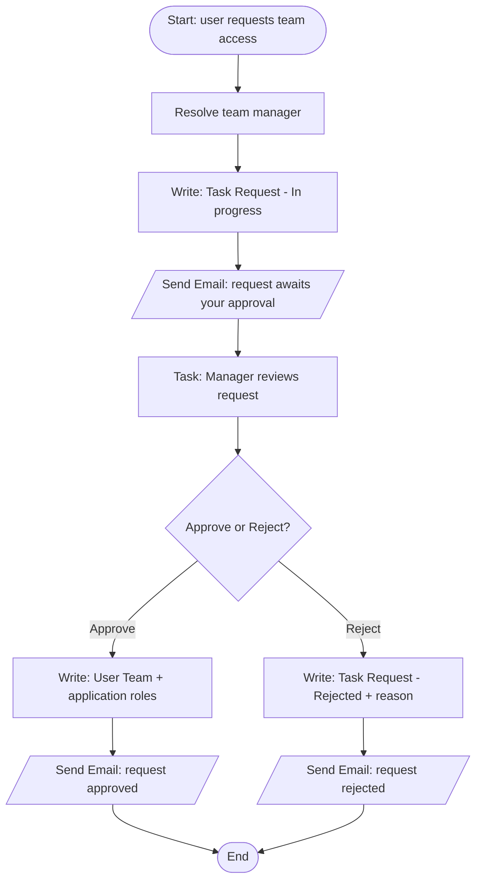
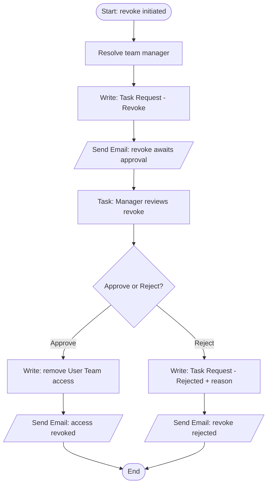
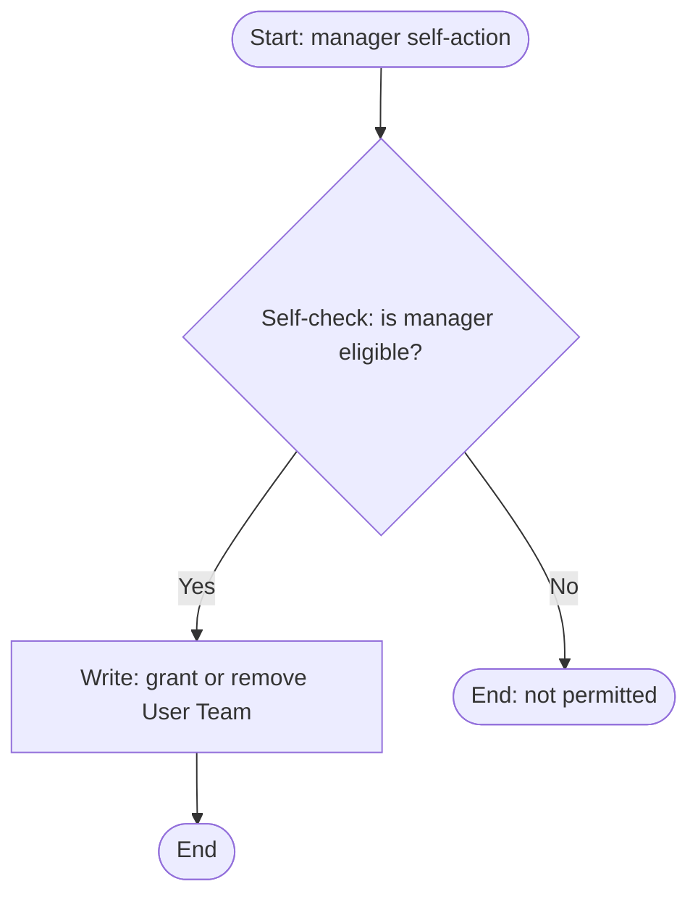

# Functional Requirements Document — User Access Management (UAM)

**Application code:** UAT_1
**Platform:** Appian
**Document date:** 2026-07-28
**Audience:** Business stakeholders, product owners, and business analysts
**Status:** Draft for stakeholder review

> This FRD describes *what* the User Access Management application does and *why*, in business terms. It is derived from the application's source and knowledge graph. Items that cannot be determined from the application structure alone are marked `[TBD]` in §18.

---

## 1. Purpose & Scope

The **User Access Management (UAM)** application governs *who* in an enterprise can access *which* business applications, and *how* that access is granted, reviewed, and revoked. It is a centralized access-governance system that maintains the organizational structure, the teams within it, the applications and roles under governance, and the users who need access — then controls access changes through a **manager-approved request workflow** with full audit history.

**In scope:**
- Maintaining organizations (with addresses, contacts, and a parent/child hierarchy), teams, applications, application roles, and users.
- Mapping users and teams to organizations, and applications/roles to teams and organizations.
- A request-and-approval workflow for granting and revoking a user's access to a team, routed to the team's manager, with email notifications and an auditable event history.
- User lifecycle: create, update, activate, deactivate, and remove.

**Out of scope (not present in the application):** external identity providers, single sign-on provisioning, third-party API integrations, and automated de-provisioning schedules. UAM is self-contained around its own database.

---

## 2. Stakeholders & Users

UAM defines seven security groups (all closed-membership — members are added only by group administrators). They resolve into these roles:

| Role | Group | Who they are | What they can access |
|------|-------|--------------|----------------------|
| System Administrator | UAM System Admins | Platform owners of UAM | Highest-privilege configuration; the System Admin console pages |
| Administrator | UAM Administrators | Access-governance administrators | Full create/update across organizations, teams, applications, users, and mappings; site administrator |
| Manager | UAM managers | Team/organization managers who own approval decisions | The **Manager Tasks** page; approve/reject access requests; manage roles; self-service grant/remove; authority across parent and child organizations |
| General User / Viewer | UAM Users | Everyday users needing access | Read application data; request team access; site viewer |
| Active User | UAM Active User | Users whose accounts are active | Membership marker granting active-user access |
| Application User | UAM Application User | All application users | Baseline membership |
| Alert Receiver | UAM Process Model Alert Receivers | *(System, non-human)* | Receives process-exception alerts |

**The system shall** differentiate what each role sees through both object security (Administrators = edit, Users = view) and rule-based visibility (System Admin and Manager surfaces are gated by expression rules such as "Only Managers can see the Task").

---

## 3. Functional Requirements

Priority uses MoSCoW (Must / Should / Could / Won't).

### 3.1 User Management
| ID | Requirement | Priority |
|----|-------------|----------|
| FR-U1 | The system shall allow an administrator to create and update user records. | Must |
| FR-U2 | The system shall allow an administrator to activate and deactivate a user account. | Must |
| FR-U3 | The system shall allow an administrator to remove a user. | Should |
| FR-U4 | The system shall add and remove users from Appian security groups as part of activation and access changes. | Must |

### 3.2 Organization Management
| ID | Requirement | Priority |
|----|-------------|----------|
| FR-O1 | The system shall allow an administrator to create and update organizations, including address and contact details. | Must |
| FR-O2 | The system shall maintain a parent/child organization hierarchy (sub-organizations). | Must |
| FR-O3 | The system shall allow selecting and removing sub-organizations from a parent. | Should |
| FR-O4 | The system shall constrain address entry using reference data for city, state, and country. | Should |

### 3.3 Team Management
| ID | Requirement | Priority |
|----|-------------|----------|
| FR-T1 | The system shall allow creating and updating teams. | Must |
| FR-T2 | The system shall map teams to organizations. | Must |
| FR-T3 | The system shall assign and remove team roles. | Must |
| FR-T4 | The system shall associate teams with applications. | Should |

### 3.4 Application & Role Governance
| ID | Requirement | Priority |
|----|-------------|----------|
| FR-A1 | The system shall allow registering business applications under governance. | Must |
| FR-A2 | The system shall map applications and application roles to organizations and teams. | Must |
| FR-A3 | The system shall allow attaching and removing application groups. | Should |
| FR-A4 | The system shall allow removing team application roles. | Should |

### 3.5 Access Request & Approval
| ID | Requirement | Priority |
|----|-------------|----------|
| FR-R1 | The system shall allow a user to request access to a team. | Must |
| FR-R2 | The system shall route each access request to the requested team's manager for approval. | Must |
| FR-R3 | The system shall allow a manager to approve or reject a request; rejections shall capture a reason. | Must |
| FR-R4 | The system shall grant the team and its application roles to the user on approval. | Must |
| FR-R5 | The system shall support revoking a user's team access through the same approval pattern. | Must |
| FR-R6 | The system shall allow a manager to self-grant or self-remove access without a separate approval. | Could |
| FR-R7 | The system shall record every request event (submit, approve, reject, revoke) in an auditable event history with threaded replies. | Should |
| FR-R8 | The system shall prevent a user from requesting a team they already hold. | Should |

### 3.6 Notifications & Reporting
| ID | Requirement | Priority |
|----|-------------|----------|
| FR-N1 | The system shall email the team manager when an access request is submitted. | Must |
| FR-N2 | The system shall email the requester when a request is approved, rejected, or revoked. | Must |
| FR-N3 | The system shall present managers a dedicated task inbox (Manager Tasks page). | Must |
| FR-N4 | The system shall present administrators a System Admin console with organization/team/application/user views and KPIs. | Should |

---

## 4. User Journeys

UAM is delivered as a single site (**User Access Management Anand**) with three pages.

### 4.1 System Admin console (page: `system-admin`, visible to all authenticated users)
1. The user opens **User Access Management**; the console lists organizations, teams, applications, and users with quick actions.
2. The user selects **New Organization / New Team / New Application / New User** (related actions) to launch the relevant create form.
3. The system displays the form; on **Submit**, it saves the record and returns the user to the console with the new record visible.
4. The user drills into an organization to view its sub-organizations, teams, users, and applications on read-only summary views.

### 4.2 Manager Tasks (page: `manager-tasks`, visible only to the managers group)
1. A manager opens **Manager Tasks**; the system displays pending access-request approval tasks (only managers can see this page).
2. The manager opens a request and reviews the requester, team, and the application roles to be assigned.
3. The manager selects **Approve** or **Reject**; on Reject, the system requires a rejection reason.
4. The system finalizes the request, emails the requester the outcome, and records the decision in the request's event history.

### 4.3 Access request (initiated from the console)
1. A user selects an organization and a team they need access to.
2. The system resolves the team's manager and creates a request with status *In progress*.
3. The system emails the manager that a request awaits approval.
4. The user tracks status on the user-team request grid until it is approved or rejected.

---

## 5. Grid & List Specifications

| Grid interface | Purpose | Typical columns | Actions |
|----------------|---------|-----------------|---------|
| `UAM_readonlygrid_OrganizationData` / `UAM_gridlayout_toDisplayAllOrganizations` | List organizations | Organization name, hierarchy, contact | Drill to summary, New Organization |
| `UAM_gridlayout_userTeamRequest` | Track access requests | Requester, team, status, submitted date | View, (manager) Approve/Reject |
| `UAM_readonlygrid_teamDetails` / `UAM_gridlayout_TeamNamesOnly` | List teams | Team name, role | New Team, edit |
| `UAM_readonlygrid_applicationDetails` / `UAM_gridlayout_applicaton` | List applications | Application, group, roles | New Application, edit |
| `UAM_readonlygrid_getUserDetails` / `UAM_gridlayout_userDetails` | List users | Name, active status | New/Update User, Activate/Deactivate |
| `UAM_editablegrid_selectAndDeselect*` | Add/remove selections (sub-orgs, teams, users, roles) | Selectable rows | Select / Deselect |

*The system shall* apply record-level visibility (per-page view rules) so that non–system-admin users see an appropriately filtered set (`UAM_readonlygrid_OrganizationDataNotForSystemAdmins`).

---

## 6. Form Specifications

| Form interface | Creates/Updates | Key fields | Behaviour |
|----------------|-----------------|-----------|-----------|
| `UAM_form_createorUpdateOrganization` | Organization + address + contacts | Organization name, address (city/state/country from reference data), contact details, project manager | Multi-section; Submit / Cancel |
| `UAM_formlayout_createOrUpdateTeam` | Team | Team name, roles | Submit / Cancel |
| `UAM_formlayout_createOrUpdateUser` / `UAM_textfield_createUser` | User | User details, active flag | Submit / Cancel |
| `UAM_formlayout_createorUpdateApplication` | Application | Application name, group, roles | Submit / Cancel |
| `UAM_formlayout_organizationUser` / `_organizationTeam` / `_organizationApplication` | Membership mappings | Selected users / teams / applications | Assign / Remove |
| `UAM_formlayout_toactivateUser` / `_toDeactivateUser` | User active status | Active toggle | Confirm |
| `UAM_formlayout_dialogueBox` / `_Revoke_Access` | Manager confirmation | Confirm dialog before join/remove | Confirm / Cancel |
| `UAM_formlayout_userTeamRemoveRequest` | Revoke request | Team, reason | Submit |

*The system shall* require a **Reason For Rejection** on the approval-reject path, and *shall* prevent duplicate team requests (`UAM_qry_excludeteamsToAlreadyAdd`). Field-level validation detail is `[TBD]` (§18).

---

## 7. Dashboard Specifications

| Dashboard interface | Content |
|---------------------|---------|
| `UAM_kpi_todisplayKPI` | Key metrics for the application (counts/status) |
| `UAM_kpi_systemAdminInteractionPage` / `UAM_wrapper_systemAdmin` | System Admin interaction hub with quick actions |
| `UAM_card_organization` / `UAM_cardgrid_OrganizationData` / `UAM_stattile_organization` | Organization cards and stat tiles |
| `UAM_sectionlayout_quickActions` | Quick-action launcher for create flows |
| `UAM_interface_dynamic_Interface` | Renders content dynamically based on the logged-in user's role |

Exact KPI definitions (which counts) are `[TBD]` (§18).

---

## 8. Business Rules

**Access & routing**
- Access requests route to the requested team's manager (`UAM_getTeamManager`).
- Only managers may act on approval tasks ("Only Managers can see the Task"); logged-in-user manager status is checked (`UAM_qry_checkWhetherLoggedInUserIsManager`).
- A manager may self-grant/self-remove only when eligible (`UAM_qry_selfCheckManager`).

**Validation**
- A rejected request must include a rejection reason.
- A user cannot request a team already held.
- Address city/state/country must come from reference data.

**Lifecycle / status**
- An access request moves through *In progress → Approved / Rejected / Cancelled*.
- Requests are typed as *Team Access Add Approval* or *Team Access Revoke Approval*.

**Security / visibility**
- Object security is two-tier (Administrators edit, Users view); System Admin and Manager surfaces are gated by visibility rules and per-page view rules.

**Formatting / display**
- Site branding (name, colors) is configuration-driven; user names and timestamps are normalized by helper rules (`UAM_setUserName`, `UAM_setDateTime`).

---

## 9. Workflow Requirements

### 9.1 Access Request — Grant
**Business outcome:** a user gains approved, auditable access to a team and its application roles.

### 9.2 Access Request — Revoke
**Business outcome:** a user's team access is removed under manager control, with notification and audit.

### 9.3 Manager Self-Service
**Business outcome:** a manager grants or removes their own access without waiting on a separate approver.

**Exception handling:** every process routes unhandled exceptions to the **UAM Process Model Alert Receivers** group.

---

## 10. Notifications

UAM **does send automated email notifications** through its `UAM Send Email` process and dedicated email-body rules.

| Trigger | Recipients | Content (body rule) | Business purpose |
|---------|-----------|---------------------|------------------|
| Access request submitted | The requested team's **manager** | `UAM_requestaccess_generateEmailBodyForManager` | Prompt the approver to action a pending request |
| Revoke request submitted | The team's **manager** | `UAM_revokeaccess_generateEmailBodyForManager` | Prompt the approver to action a pending revoke |
| Request approved | The **requester** | `UAM_revokeaccess_generateEmailBodyForApprove` | Confirm access has been granted |
| Request rejected | The **requester** | `UAM_generateEmailBodyForReject` | Inform of rejection and the reason |
| Revoke rejected | The **requester** | `UAM_revokeaccess_generateEmailBodyForRejected` | Inform the revoke was not actioned |

In addition, **Appian task notifications** are automatically raised to the assigned **manager** for each approval task (the Manager Tasks inbox). Exact subject/body wording is `[TBD]` (§18) — the body rules exist but their rendered text was not expanded.

---

## 11. State Machines

### Access Request
| From | Trigger | To | Side effects |
|------|---------|----|--------------|
| *(none)* | User submits request | In progress | Task Request created; manager emailed |
| In progress | Manager approves | Approved | User Team + roles granted; requester emailed; event logged |
| In progress | Manager rejects | Rejected | Reason captured; requester emailed; event logged |
| In progress | Request withdrawn | Cancelled | Event logged |

### User account
| From | Trigger | To | Side effects |
|------|---------|----|--------------|
| Active | Administrator deactivates | Inactive | Group membership adjusted |
| Inactive | Administrator activates | Active | Added to Active Users group |

---

## 12. Data Requirements

UAM persists 31 record types in a MariaDB database (`UAMS`), all as Appian synced records. Core entities:

**UAM User** — a person who can be granted access.
| Field | Type | Required | FK | Description |
|-------|------|----------|----|-------------|
| id | Integer | Yes | PK | Surrogate key |
| (profile fields) | Text | — | — | Name and contact details |
| userOrganization | Rel | — | User Organization | Org memberships |

**UAM Organization** — a governed organization.
| Field | Type | Required | FK | Description |
|-------|------|----------|----|-------------|
| id | Integer | Yes | PK | Surrogate key |
| organizationAddress / contactDetails | Rel | — | Address / Contact | Address & contacts |
| organizationHierarchyData | Rel | — | Org Hierarchy | Parent/child links |
| projectManagerUser / createdByUser / modifiedByUser | Rel | — | System User | Ownership/audit |

**UAM Task Request** — an access-request record.
| Field | Type | Required | FK | Description |
|-------|------|----------|----|-------------|
| id | Integer | Yes | PK | Surrogate key |
| taskStatusId | Integer | Yes | Task Status | In progress/Approved/Rejected/Cancelled |
| taskDefinitionId | Integer | Yes | Task Definiation | Add / Revoke |
| orgid | Integer | Yes | Organization | Owning org |
| taskRequestTeam | Rel | Yes | Team | Requested team |
| assignedBy / assignedTo / assignedOn | Mixed | — | — | Assignment metadata |
| reasonForRejection | Text | Conditional | — | Required on reject |
| createdBy/On, modifiedBy/On, isActive | Mixed | Yes | — | Audit fields |
| eventHistory / subscriber | Rel | — | Event History / Subscriber | Audit trail |

Additional entities: Team, Team Role, Application, Application Role, Group, User Organization, User Team, Organization Team, Organization Application, Organization Address/Contact/Hierarchy, the Task Request/Team event-history + reply-thread + subscriber tables, and reference data (Country, State, City, Ref Role). Full field detail per table is `[TBD]` (§18).

---

## 13. Integration Requirements

| Integration | External system | Data flows | Business purpose |
|-------------|-----------------|-----------|------------------|
| UAM Data Source (connected system) | MariaDB database `UAMS` (BASIC auth, user `UAMS.dsuser`) | Read/write all 31 record types | System of record for all UAM data |
| Platform email | Appian mail service | Outbound notifications | Manager and requester notifications |
| `WebApiRequest?list` Web API | HTTP consumers | Read organization data | Expose organization list to external callers |

> **Note (modernization):** the MariaDB Data Source connector is flagged by Appian as deprecated for Aurora MySQL connections — a migration to the Aurora MySQL connected system is recommended.

---

## 14. Access Control

| Record area | View | Create | Edit | Delete |
|-------------|------|--------|------|--------|
| Organizations / Teams / Applications / Users | UAM Users | UAM Administrators | UAM Administrators | UAM Administrators |
| Access requests (approve/reject) | Requester + Managers | Users (request) | Managers (decision) | — |
| Site administration | UAM Administrators | — | — | — |

**Page visibility:**
- `system-admin` — all authenticated users.
- `manager-tasks` — restricted to the **UAM managers** group (`isUserMemberOfGroup`).
- `test` — all users *(non-production; recommend removal)*.

---

## 15. Non-Functional Requirements

- **Performance:** Data access is via Appian synced records over MariaDB, which supports responsive grid/query performance; large list views should rely on record-level filters and pagination.
- **Availability:** Single backing database — availability is tied to that data source; there is no secondary store or failover integration in the app.
- **Security:** Closed-membership groups; encrypted database credentials in the connected system; two-tier object security plus rule-based visibility for privileged surfaces. **Recommendation:** confirm segregation of duties on manager self-service, and remove non-production practice objects/pages before production.
- **Auditability:** Every access decision is captured in the Task Request event history with threaded replies and subscribers — a strong audit posture for an access-governance system.

---

## 16. Traceability Matrix

| Business requirement | Interfaces | Process models | Record types |
|----------------------|-----------|----------------|--------------|
| FR-R1..R5 Access request/approval | approvalInterface, userApplicationRolesApproval, userTeamRequest, eventhistory | Initiate/Approval/Revoke (+New/Recent) | Task Request, User Team, Team, Application Role, User |
| FR-O1..O4 Organization mgmt | createorUpdateOrganization, sub-org grids, summary views | Create/Update Organization, Sub Organization | Organization, Org Address/Contact/Hierarchy |
| FR-T1..T4 Team mgmt | createOrUpdateTeam, team grids, editable role grids | Create/Update Team, Map Org Team, Team Application | Team, Team Role, Organization Team |
| FR-A1..A4 Application governance | createorUpdateApplication, application grids | Create Application, Application/Org Application | Application, Application Role, Group |
| FR-U1..U4 User lifecycle | createOrUpdateUser, activate/deactivate forms | Create/Update/Activate/Deactivate/Remove User | User, Group |
| FR-N1..N2 Notifications | (email-body rules) | Send Email | Task Request |

---

## 17. Glossary

| Term | Meaning |
|------|---------|
| Organization | A governed business unit; can nest into parent/child hierarchies |
| Sub-organization | A child organization under a parent |
| Team | A group within an organization to which access is granted |
| Team Role | A role a team carries, tied to a security group |
| Application | A business application under access governance |
| Application Role | A role/group mapping for an application |
| Access Request (Task Request) | A record capturing a user's request to gain or lose team access |
| Task Definition | The request type — Add Approval or Revoke Approval |
| Task Status | Request state — In progress, Approved, Rejected, Cancelled |
| Manager | The approver for a team's access requests; authority spans parent/child orgs |
| Event History | The auditable log of events on a request, with reply threads and subscribers |
| UAM Data Source | The MariaDB connected system backing all records |
| Manager Tasks | The site page presenting managers their pending approvals |

---

## 18. Open Issues

- **[TBD-1]** What is the exact field-level validation on each create/update form (required fields, formats, length limits)? Not fully determinable from structure — confirm with the build team.
- **[TBD-2]** Can a manager approve their *own* access request, or is self-approval blocked? `UAM_qry_selfCheckManager` exists but the control's intent is unconfirmed — this is a segregation-of-duties question for stakeholders.
- **[TBD-3]** What are the exact email subject/body texts and any escalation/reminder rules for pending approvals? The body rules exist but rendered content and any SLA/timeout were not captured.
- **[TBD-4]** Which specific KPIs does the System Admin dashboard display, and what are their definitions?
- **[TBD-5]** Should the non-production **Test** site page and practice interfaces/rules be removed before production release? Recommend yes — confirm with the owner.
