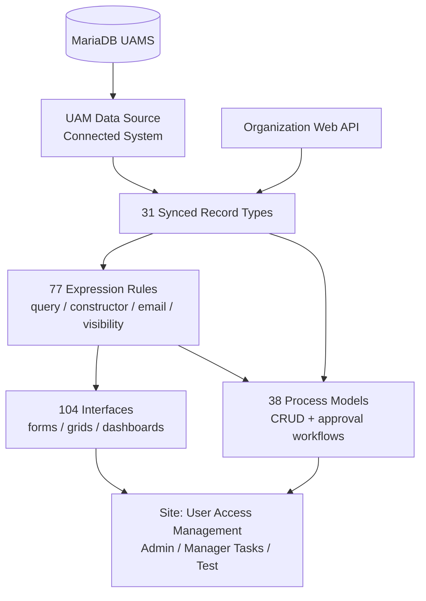
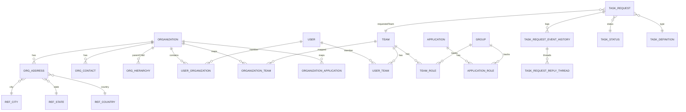
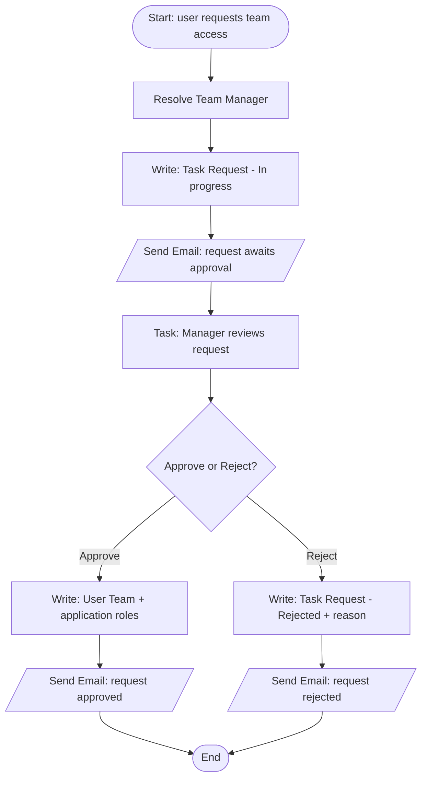
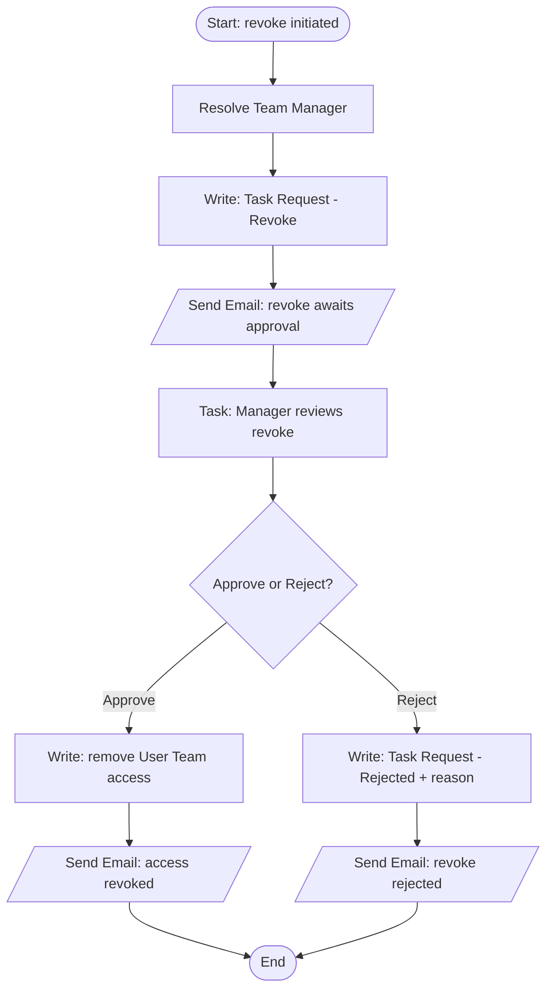
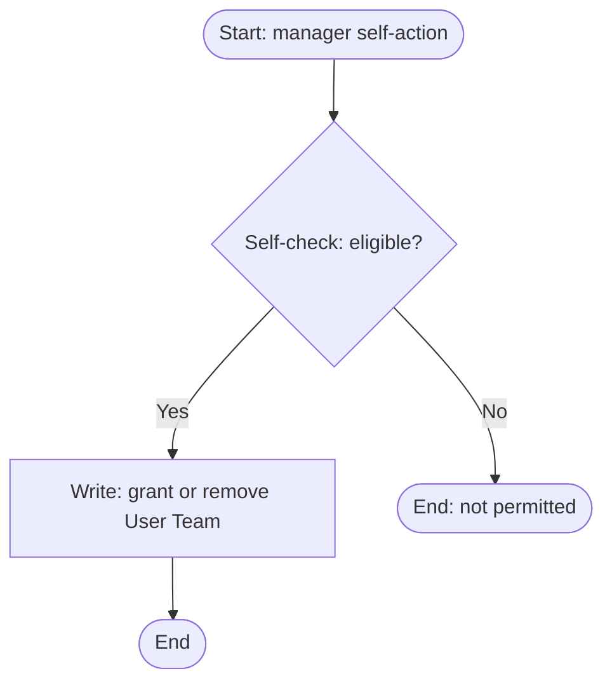
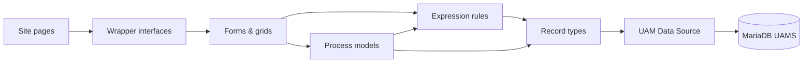

# Technical Design Document — User Access Management (UAM)

**Application:** User Access Management (UAT_1)
**Platform:** Appian
**Prepared:** 2026-07-28
**Audience:** Engineering — developers and architects who will maintain or extend this application

---

## 1. Executive Summary

User Access Management (UAM) is an access-governance application built on Appian. Its job is to model an enterprise's organizational structure (organizations, a parent/child org hierarchy, and teams), the business applications and roles under governance, and the users who need access — and to control every access change through a manager-approved request workflow with a full audit trail.

The central data abstraction is the **`UAM Task Request`** record: an access request that moves through a fixed status lifecycle (In progress → Approved / Rejected / Cancelled), is typed as either an *Add* or *Revoke* approval task, and carries a threaded event history. Around it sits a relational model of 31 synced record types, all replicated from a single MariaDB database (`UAMS`) via one connected system. There are no external integrations — UAM is self-contained around its own data store, with a single outbound Web API exposing organization data.

The user-visible surface is one Appian **Site** ("User Access Management Anand") with three pages: a System Admin console (organizations/teams/applications/users), a manager-gated Manager Tasks approval inbox, and a non-production Test page. The build is UI- and workflow-heavy: 104 interfaces and 38 process models dominate the 301-object inventory. The architecture is clean (0 knowledge-graph health findings) but carries one CRITICAL runtime risk — an N+1 query in the team grids — documented in §15.

---

## 2. Module Overview & Architecture

UAM follows a **capability-layered** design rather than a naming-convention module split: every object is prefixed `UAM`, and functional grouping comes from capability (Access Request & Approval, Organization/Team/Application management, User lifecycle) rather than sub-prefixes. Object-type intent is encoded in interface/rule name segments (`_form*`, `_gridlayout_*`, `_qry_*`, `_constructor_*`).

| Object type | Count |
|-------------|------:|
| Application | 1 |
| Site | 1 |
| Web API | 1 |
| Connected System | 1 |
| Group | 7 |
| Record Type | 31 |
| Process Model | 38 |
| Interface | 104 |
| Expression Rule | 77 |
| Constant | 32 |
| Folder | 4 |
| Unknown | 4 |
| **Total nodes / edges** | **301 / 1366** |

**Layers:** (1) Data — synced record types over MariaDB; (2) Logic — expression rules for queries, payload construction, email bodies, and visibility gating; (3) Orchestration — process models for CRUD and the grant/revoke approval flows; (4) Presentation — interfaces composed onto the site pages.

---

## 3. Data Architecture

The model centers on three hubs: **Organization** (structure), the **User↔Team↔Organization** access triangle, and the **Task Request** audit chain. All 31 record types are Appian synced records (`RecordsReplica`) from the `UAMS` schema; surrogate integer `id` primary keys with camelCase fields and standard audit columns. The org hierarchy is modeled with a self-referencing `UAM Organization Hierarchy Data` record (parent and child both FK to Organization). Reference/lookup tables (country/state/city/role, task status, task definition) back dropdowns and status enumerations.

**Entity families:** core (User, Organization+Address+Contact+Hierarchy, Team, Team Role, Application, Application Role, Group, Task Request); junction (User Organization, User Team, Organization Team, Organization Application); audit (Task Request/Team event history + reply threads + subscribers + event types); reference (Country/State/City, Ref Role, Task Status, Task Definiation, Feedback Category).

### Key entity — UAM Task Request

| Field | Type | Required | FK | Description |
|-------|------|----------|----|-------------|
| id | Integer | Yes | PK | Surrogate key |
| taskStatusId | Integer | Yes | Task Status | In progress / Approved / Rejected / Cancelled |
| taskDefinitionId | Integer | Yes | Task Definiation | Team Access Add / Revoke Approval |
| orgid | Integer | Yes | Organization | Owning organization |
| taskRequestTeam | Rel | Yes | Team | Requested team |
| assignedBy / assignedTo / assignedOn | Mixed | — | User | Assignment metadata |
| taskName | Text | — | — | Display name |
| reasonForRejection | Text | Cond. | — | Required on reject |
| createdBy/On, modifiedBy/On, isActive | Mixed | Yes | — | Audit + soft-delete |
| eventHistory / subscriber | Rel | — | — | Audit trail relationships |

---

## 4. Data Store Entities (CDTs)

UAM defines **no Custom Data Types (CDTs)**. The knowledge graph contains zero `DataType` nodes — persistence is modeled entirely through synced record types (§3, §5), and expression rules pass data as record maps and dictionaries (e.g. `UAM_consuctor_UserTeamData`, `UAM_constructor_setTeam`) rather than typed CDTs. There are no standalone data structures to document here.

---

## 5. Record Type Configuration

All 31 record types are synced (`RecordsReplica`) over the `UAM Data Source` connected system. Highlights:

**Relationships (52 total, representative):**

| Record | Relationship | Target | Cardinality |
|--------|--------------|--------|-------------|
| Organization | organizationHierarchyData | Organization Hierarchy Data | 1→M |
| Organization | userOrganization / organizationTeam / organizationApplication | junctions | 1→M |
| Organization | projectManagerUser / createdByUser / modifiedByUser | System User | M→1 |
| Organization Hierarchy Data | parentorganizationData / childorganizationData | Organization | M→1 each (self-ref) |
| User Team | user / team / organization | User / Team / Organization | M→1 each |
| Team | teamRole | Team Role | 1→M |
| Team Role / Application Role | group | Group | M→1 |
| Task Request | taskStatus / taskDefiniation / organization / taskRequestTeam | lookups + Team | M→1 |
| Task Request | eventHistory / subscriber | Event History / Subscriber | 1→M |
| Task Request Event History | eventUser / eventType / replyThread | User / Event Type / Reply Thread | mixed |

**Record actions (20 `REFERENCES_RECORD_ACTION` edges):** create/update/lifecycle actions launched via `UAM_RELATEDACTION_*` and `UAM_PM_*` process-model pointer constants (new org/team/app/user, activate/deactivate, request/approve/revoke access).

**Security:** object security is two-tier — `UAM Administrators` (editor, 79 assignments) and `UAM Users` (viewer, 78 assignments); per-page record visibility is layered on via `UAM_QRY_setUserPageView` / `setTeamPageView` / `setApplicationPageView`.

---

## 6. Process Model Design

38 process models implement CRUD and the approval workflows. Internal node topology was not exhaustively parsed; flows below are reconstructed from called rules/records/constants. All non-trivial models route exceptions to the `UAM Process Model Alert Receivers` group.

### Access Request — Grant
**Outcome:** a user gains approved, auditable access to a team and its application roles.

**Key objects:** `UAM_getTeamManager`, `UAM_constructor_setTeam`, `UAM_requestaccess_generateEmailBodyForManager`, `UAM_consuctor_UserTeamData`, constants `UAM_TXT_BUTTON_VALUE_APPROVE/REJECT`, `UAM_INT_REF_VALUE_ID_TASK_STATUS/DEFINITATION`.

### Access Request — Revoke

**Key objects:** `UAM_constructor_setTeamForRevoke`, `UAM_toRemoveOrganizationUserTeam`, `UAM_revokeaccess_generateEmailBodyForManager/Approve/Rejected`.

### Manager self-service

Gated by `UAM_qry_selfCheckManager` — see the segregation-of-duties note in §15.

**Other process families:** Organization (create/update, sub-org select/remove, hierarchy), Team & membership mapping, Application & role governance, User lifecycle (create/update/activate/deactivate/remove), and a reusable `UAM Send Email` subprocess. Several near-duplicate variants exist (`…Approval` vs `…Approval Recent`, `…Access` vs `…Access New`, revoke variants) — consolidation candidates.

---

## 7. Interface Architecture

104 interfaces, classified by name convention and composed onto the site pages. UX model: an admin console with quick actions/related actions launching create/update forms, read-only summary views for drill-down, and a manager approval task form.

| Pattern | Naming | Examples | Count (approx.) |
|---------|--------|----------|-----------------|
| CRUD form | `UAM_form*`, `UAM_formlayout_*` | createorUpdateOrganization, createOrUpdateTeam/User, createorUpdateApplication | ~22 |
| Grid / list | `UAM_gridlayout_*`, `UAM_readonlygrid_*` | userTeamRequest, applicaton, TeamNamesOnly | ~24 |
| Editable selection grid | `UAM_editablegrid_*` | selectAndDeselect Teams/Users/Roles/Suborg | ~8 |
| Read-only summary | `UAM_readonly_*`, `UAM_view*` | summaryDetails, teamSummaryDetails, mappedSuborganizations | ~12 |
| Dashboard / KPI | `UAM_kpi_*`, `UAM_stattile_*`, `UAM_card*` | todisplayKPI, systemAdminInteractionPage, cardgrid_OrganizationData | ~6 |
| Page shell / wrapper | `UAM_wrapper_*` | systemAdmin, organizationData, teamData | 5 |
| Approval | `UAM_richtextdisplay_approvalInterface`, `UAM_taskform_userApplicationRolesApproval` | manager approval task | 2 |

**Rule inputs pattern:** grids expose scoping inputs (`ri!orgid`, `ri!teamid`) plus `ri!refresh`/`ri!search` toggles and selection outputs (`ri!selected`, `ri!selectedid`). `UAM_interface_dynamic_Interface` renders per logged-in user's role. `UAM_richtextfield_backToDashboard` is a shared navigation component reused across interfaces.

Practice/non-production interfaces (`UAM_practice_interface`, `UAM_exampleShuffleBetweenLists`) exist and should be removed (§15).

---

## 8. Business Logic Layer

77 expression rules, grouped by responsibility:

- **Query / fetch:** `UAM_qry_getOrganization*` (names/teams/users/applications/hierarchy), `UAM_qry_getTeamDetails`, `_getTeamRoleDetails`, `_getGroupdetails`, `_getApplicationandRoles`, `_getAppianGroupDetailsForTeams`, `UAM_qrc_getOrganizationDetails / getTaskRequestDetails / getUserDetails`. Reference lookups: `_getCity/State/CountryList`.
- **Constructors (write payloads):** `UAM_constructor_setTeam`, `_setTeamForRevoke`, `_mappingApplicationRole`, `UAM_consuctor_UserTeamData(ForSystemAdmin)`, `UAM_mapping_teamWithApplication`, `UAM_demapping_teamWithApplicationroles`.
- **Access / manager logic:** `UAM_getTeamManager`, `UAM_qry_checkWhetherLoggedInUserIsManager`, `UAM_qry_selfCheckManager`, `UAM_determineTeamRequest(Revoke)`, `UAM_qry_togetRolesFromTeam`, `UAM_qry_excludeteamsToAlreadyAdd`.
- **Lifecycle mutations:** `UAM_qry_activate/deactivateTheUser`, `_assigningOrganizationUser`, `_removeOrganizationUser(Team)`, `_toRemoveTeamFromOrganization`, `UAM_functionality_removeApplicationGroup`.
- **Notifications:** `UAM_requestaccess_generateEmailBodyForManager`, `UAM_revokeaccess_generateEmailBodyForManager/Approve/Rejected`, `UAM_generateEmailBodyForReject`, `UAM_qry_urlForSite`.
- **Visibility / UI:** `UAM_QRY_setUser/Team/ApplicationPageView`, `UAM_qry_visiblityOfOrganization`, `UAM_visiblityrule_managersTask`, `UAM_setVisiblity_manageRolesForManagersAndAdmins`, `UAM_setUserName`, `UAM_setDateTime`, `UAM_setOrganizationHierarchy`.

**Note:** `UAM_richtextdisplay_toShowTheOrgTeamRoles` contains a hardcoded `touser("prabhakar")` reference — remove (environment-specific literal). Practice rules (`UAM_qry_practiceQuestionsSet*`, `UAM_coding_functionKnowledge`) are non-production.

---

## 9. Constants & Configuration

32 constants. No secrets stored in constants (DB credentials live encrypted in the connected system).

| Group | Constants | Notes |
|-------|-----------|-------|
| Group references | `UAM_GRP_SYSTEMADMIN`, `UAM_GRP_MANAGERS`, `UAM_GROUP_ORGANIZATION_MANAGERS`, `UAM_GROUP_ACTIVE_USER`, `UAM_GROUP_ALL_APPLICATION_USERS`, `UAM_PROCESS_MODEL_ALERT_RECEVIERS` | Env-specific group UUIDs |
| Reference enumerations | `UAM_INT_REF_VALUE_ID_TASK_STATUS` (In progress/Approved/Rejected/Cancelled), `_TASK_DEFINITATION` (Add/Revoke), `_CATEGORY*` (practice) | |
| Process-model pointers | `UAM_PM_USER_TEAM_REQUEST_APPROVAL_*`, `UAM_RELATEDACTION_*` | Launch targets for related actions |
| UI action values | `UAM_TXT_BUTTON_VALUE_APPROVE/REJECT/CANCEL/SUBMIT`, `UAM_SAFELINK_BACK_TO_DASHBOARD` | |
| Site branding | `UAM_SITE_DISPLAY_NAME`, `UAM_TXT_SITE_ACCENT/BACKGROUND/LOADING_BAR/PAGE_HIGHLIGHT_COLOR`, `UAM_TIME_FORMEXPECTION` | |

**Environment-specific:** the group-reference and process-model-pointer constants carry UUIDs that differ per environment — the primary re-point targets on deployment.

---

## 10. Integration Architecture

| Integration | Type | Config | Purpose |
|-------------|------|--------|---------|
| UAM Data Source | MariaDB JDBC connected system (`MariaDbConnectedSystem`) | `jdbc:mariadb://database:3306/UAMS`, BASIC auth, user `UAMS.dsuser`, encrypted password, pool default 100 | System of record for all 31 record types |
| Organization Web API | Appian Web API (`WebApiRequest?list`) | List endpoint over organization data | Expose organization list to external HTTP callers |
| Platform email | Appian mail service | via `UAM Send Email` + email-body rules | Manager/requester notifications |

No third-party REST/SOAP integrations. The connected-system XML carries Appian's notice that connecting to **Aurora MySQL** specifically via the MariaDB connector will be unsupported in future versions — a migration consideration if the backing DB is/becomes Aurora MySQL. (Per best-practice INT-001, MariaDB itself is a supported connector and is not a generic deprecation.)

---

## 11. Security Model

**RBAC:** seven closed-membership (`MEMBERPOLICY_CLOSED`) groups. Object security is two-tier (Administrators = edit, Users = view); System Admin and Manager privilege is enforced by expression-rule visibility rather than object role maps.

**Page visibility:** `system-admin` → all authenticated users; `manager-tasks` → `isUserMemberOfGroup(<UAM managers>)`; `test` → all (non-production).

| Group | Site role | Object security | Functional role |
|-------|-----------|-----------------|-----------------|
| UAM System Admins | — | via `UAM_GRP_SYSTEMADMIN` | Top-tier config |
| UAM Administrators | site_administrator | Editor (79 uses) | Full CRUD |
| UAM managers | — | via `UAM_GRP_MANAGERS` | Approve/reject; manage roles |
| UAM Users | site_viewer | Viewer (78 uses) | Read + request access |
| UAM Active User | — | — | Activated-account marker |
| UAM Application User | — | — | Baseline membership |
| UAM Process Model Alert Receivers | — | — | System alert routing |

| Action | System Admin | Administrator | Manager | User |
|--------|:---:|:---:|:---:|:---:|
| Create/edit org/team/app/user | ✅ | ✅ | scoped | — |
| Approve/reject access | — | — | ✅ | — |
| Manage roles | ✅ | ✅ | ✅ | — |
| Request access | ✅ | ✅ | ✅ | ✅ |
| View records | ✅ | ✅ | ✅ | ✅ |

---

## 12. Naming Conventions

| Object type | Pattern | Conformance |
|-------------|---------|-------------|
| Record types | `UAM <Title Case>` | Consistent (spelling drift: `Definiation`, `Hichearcy`) |
| Interfaces | `UAM_<objectType>_<camelCase>` | Consistent prefix; type-segment convention |
| Expression rules | `UAM_<qry/qrc/constructor/…>_<name>` | Consistent (drift: `consuctor`, `visiblity`) |
| Constants | `UAM_<UPPER_SNAKE>` | Consistent |
| Groups | `UAM <Title Case>` | Consistent |

Non-conforming: misspellings (`Definiation`/`consuctor`/`Hichearcy`/`visiblity`) and 4 `Unknown`-typed nodes (likely practice/test artifacts). A controlled rename pass is recommended.

---

## 13. Domain Glossary

| Term | Meaning |
|------|---------|
| Organization | A governed business unit; nests via parent/child hierarchy |
| Organization Hierarchy Data | Self-referencing record modeling the org tree |
| Team | A group within an organization to which access is granted |
| Team Role | A role a team carries, backed by an Appian security group |
| Application / Application Role | A governed business app and its role/group mapping |
| Task Request | The access-request record (grant or revoke) |
| Task Definiation | Request type — Add or Revoke Approval (spelling as-built) |
| Task Status | In progress / Approved / Rejected / Cancelled |
| Event History / Reply Thread | Auditable log + threaded replies on a request |
| UAM Data Source | The MariaDB connected system backing all records |
| Alert Receivers | System group receiving process-exception alerts |
| Manager Tasks | Manager-gated site page presenting pending approvals |

---

## 14. Module Dependencies

Highest fan-in (single points of failure): the `UAM Administrators` / `UAM managers` groups, the `UAM Task Request` record, the `UAM Data Source` connected system, and `UAM_PROCESS_MODEL_ALERT_RECEVIERS`. Deploy order: connected system → record types → constants → expression rules → interfaces → process models → web API → site.

---

## 15. Architectural Observations

**CRITICAL**
- **N+1 query in team grids.** `UAM_gridlayout_TeamNamesOnly`'s *Access Status* column calls `UAM_qry_togetRolesFromTeam` per rendered row; that rule runs 3 chained queries (Org Team → Team Role → Group) plus a per-group `a!isUserMemberOfGroup` loop. For M rows ≈ 3M queries per evaluation. **Fix:** hoist the group lookup to a single pre-grid query keyed by team id; resolve the manager's memberships once; collapse the 3-query chain into a relationship traversal. Check sibling grids rendering the same tag.

**Medium**
- **Hardcoded user** `touser("prabhakar")` in `UAM_richtextdisplay_toShowTheOrgTeamRoles` — remove.
- **Non-production content** shipped: the `test` site page, `UAM_practice_interface`, `UAM_exampleShuffleBetweenLists`, `UAM_qry_practiceQuestionsSet*`, `UAM_coding_functionKnowledge`, and the practice `CATEGORY` constants + 4 `Unknown` nodes. Remove before release.
- **Missing `stackWhen`** on ~9 of 12 `sideBySideLayout` interfaces — mobile layouts will compress unreadably. Add `stackWhen: {"PHONE","TABLET_PORTRAIT"}`.
- **Segregation of duties:** confirm `UAM_qry_selfCheckManager` prevents a manager approving their *own* request.

**Low**
- **Duplicated approval variants** (`…Approval`/`…Approval Recent`, `…Access`/`…Access New`, revoke variants) — consolidate to one parameterized flow to cut maintenance surface and drift risk.
- **Spelling drift** in object/field names — controlled rename pass.

**CRUD completeness:** create/update/delete + activate/deactivate paths exist for the core entities (org, team, application, user) and the access request/revoke lifecycle is symmetric. No structural gaps found; the knowledge graph reports 0 orphans/missing dependencies.

---

*Generated by `/build-tdd`. Diagrams are inline Mermaid, rendered to PNG in the Word edition.*
